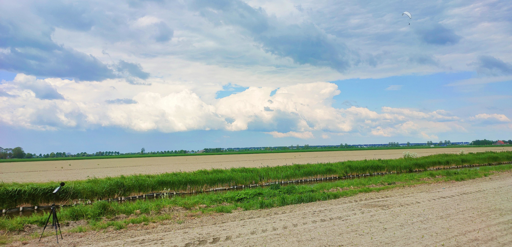
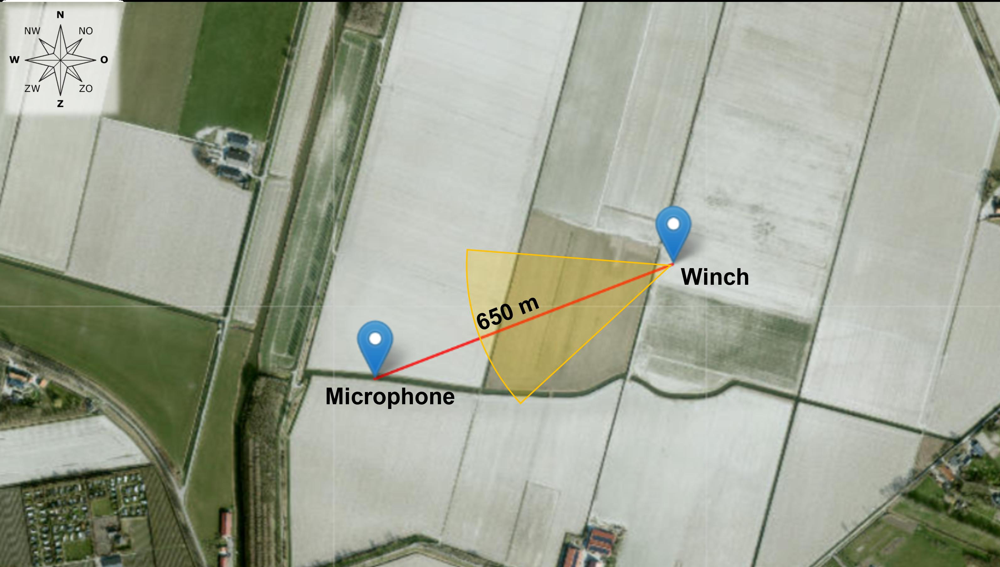
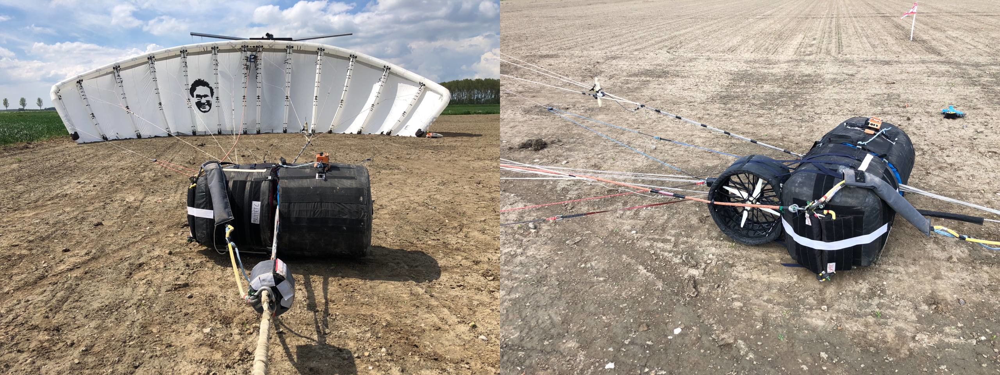
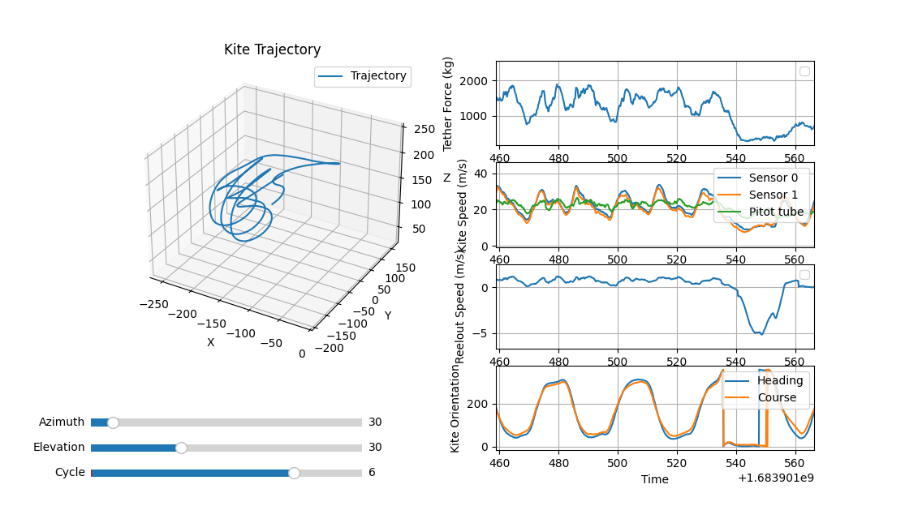

# Kitepower flight data acquired on 12 May 2023

The dataset describes a test flight conducted on 12 May 2023, on farmland next to the village of Dirksland on the island Goeree-Overflakkee in the western Netherlands.
The test flight spanned the time period from 14:14 to 14:32 UTC, completing a total of 8 pumping cycles.
The measured ground wind speed during the flight was between 4 and 10 m/s, the altitude of the kite varied between 100 and 250 m with an airspeed between 20 and 40 m/s.
One of the objectives was the measurement of the acoustic ground footprint of the system <a href="#Bouman2023">[1]</a>.

*Measuring the acoustic footprint of the kite with a microphone. Photo by Naomi Bouman, 12 May 2023.*

The wind direction during the test was North East (↙), resulting in the flight direction of the kite being South West. 
The microphone for sound recordings was placed downwind at a distance of 650 m from the ground station. 
The flight zone of the kite, the winch and the location of the microphone are shown in the following illustration.

*Overview of the measurement setup with the flight zone indicated in the yellow area. The GPS location of the ground station was 51.76862°, 4.1189°. Illustration by Naomi Bouman, 12 May 2023.*

The following amateur video illustrates the first 2 minutes of the test flight, including the launch of the kite. 

https://github.com/user-attachments/assets/5143e017-3689-4b8f-ac18-f6928d7e5294

A professional TV production around a similar test flight on 6 June 2023 at the same location is available [on YouTube](https://www.youtube.com/watch?v=pP4nypsfnzY) (forward to 4:48 minutes).

## System configuration
For this specific test, the 60m² leading-edge inflatable V9 kite was flown under conservative operational settings. 
The primary focus of the test was data acquisition and sound measurements rather than maximizing energy production. 
As a result, the power output during the flight was significantly lower than that of standard Kitepower operations. 
The main system parameters are listed in the following table, the kite, the suspended kite control unit (KCU) and the attached ram-air turbine for onboard power supply are shown in the following photos.

| **Kite**                     |           | **Tether**   |           | **KCU**         |          |
|------------------------------|-----------|--------------|-----------|-----------------|-----------|
| Total wing area              | 60 m²     | Density      | 724 kg/m³ | Diameter        | 0.62 m    |
| Projected wing area          | 46.85 m²  | Diameter     | 14 mm     | Length          | 1.2 m     |
| Total mass                   | 62 kg     |              |           | Total mass      | 31.6 kg   |

*V9 kite with KCU in the foreground before launch (left), and KCU with mounted ram-air turbine (right).*

## Key measurements include:

- **Position, Orientation, Velocities, and Accelerations**: Recorded at two of the kite’s central struts using Pixhawk IMU+GPS systems, encompassing translational and rotational kinematics.
- **Airflow Measurements**: Collected using a pitot tube and wind vanes to measure angle of attack, sideslip angle, apparent windspeed and airspeed temperature. The sensor was installed in the front bridle lines of the kite. 
- **Tether Force**: Measured at the ground station using a load cell and an elevation angle encoder.

*Data plotted for the 6th pumping cycle.*

## Terms and requests concerning using the data:
The contents of this repository are published under a CC BY-NC 4.0 license: the data can be used as long as attribution is made to this repository. Nevertheless, if you pursue a publication that uses the data we request you to:
- Stress that the test flight does not represent the state-of-the-art of Kitepower as (1) the system configuration was already dated at the time of the test and has gone through substantial development since then and (2) the test was focused on data acquisition rather than maximising energy production;
- Acknowledge Kitepower and include a link to https://thekitepower.com;
- Send the preprint including the data via email to publications@kitepower.nl;
- Allow Kitepower to post the preprint of the publication on kitepower.nl and/or Kitepower-related networks, if such public posting is in accordance with the agreement between author and publisher.

## Wind estimation via EKF

We recommend using the [EKF-AWE](https://github.com/ocayon/EKF-AWE) repository for Extended Kalman Filter–based ambient wind estimation from flight data.

## Content of the data set

The acquired data is provided in csv-format. In the content description, we use the following abbreviations:
- NED: North-East-Down earth-fixed reference frame
- FRD: Forward-Right-Down body-fixed reference frame

### Kite kinematics measurements

- kite_0: Pixhawk unit 0 - Mounted on the central strut of the kite 
- kite_1: Pixhawk unit 1 - Mounted on the kite control unit (KCU)
  
The kite position data is derived from measurements taken by Pixhawk unit 0 and processed using the default Kalman filter implementation provided by Pixhawk. 

## Variables

| Variable                        | Description                                                                                                                                                                                   | Unit             |
|---------------------------------|-----------------------------------------------------------------------------------------------------------------------------------------------------------------------------------------------|------------------|
| time                            | Unix timestamp: number of seconds since 0:00 UTC on January 1, 1970                                                                                                                           | s                |
| date                            | Date                                                                                                                                                                                           | dd-mm-yyyy       |
| time_of_day                     | Time                                                                                                                                                                                           | hh:mm:ss (UTC+2) |
| kite_{sensor_id}_vx             | x-component of the kite velocity in the NED earth reference frame                                                                                                                              | m/s              |
| kite_{sensor_id}_vy             | y-component of the kite velocity in the NED earth reference frame                                                                                                                              | m/s              |
| kite_{sensor_id}_vz             | z-component of the kite velocity in the NED earth reference frame                                                                                                                              | m/s              |
| kite_{sensor_id}_roll           | Roll angle as part of the 3-2-1 Euler sequence to get from the NED earth to the FRD body reference frame                                                                                        | deg              |
| kite_{sensor_id}_pitch          | Pitch angle as part of the 3-2-1 Euler sequence to get from the NED earth to the FRD body reference frame                                                                                     | deg              |
| kite_{sensor_id}_yaw            | Yaw angle as part of the 3-2-1 Euler sequence to get from the NED earth to the FRD body reference frame                                                                                       | deg             |
| kite_{sensor_id}_longitude       | Geodetic longitude of the kite                                                                                                                                                               | deg              |
| kite_{sensor_id}_latitude        | Geodetic latitude of the kite                                                                                                                                                                | deg              |
| kite_{sensor_id}_altitude        | Geodetic altitude of the kite                                                                                                                                                                | m                |
| ground_upwind_direction          | Instantaneous wind direction measured at ground level, relative to North, clockwise positive    | deg      |
| ground_wind_velocity              | Instantaneous wind speed measured at ground level                                              | m/s          |
| ground_tether_reelout_speed       | Reel-out speed of the tether (inferred from the rotational speed of the drum)                                                                                                               | m/s              |
| ground_tether_force               | Tether force measured at the ground station (inferred from load cell at outlet pulley and tether angle)                                                                                     | kg               |
| ground_tether_length              | Total length of the tether deployed from the ground station                                                                                                                                 | m                |
| kite_pos_east                     | Position of the kite east of the ground station (derived primarily from sensor 0 measurements)                                                                                              | m                |
| kite_pos_north                    | Position of the kite north of the ground station (derived primarily from sensor 0 measurements)                                                                                             | m                |
| kite_height                       | Height of the kite relative to the ground station (derived primarily from sensor 0 measurements)                                                                                            | m                |
| kite_heading                      | Angle between the axis pointing up and the kite x-axis projection onto the tangential plane, clockwise positive when viewed from above the kite towards the origin                            | rad              |
| kite_course                       | Angle between the axis pointing up and the kite velocity projection onto the tangential plane, clockwise positive when viewed from above the kite towards the origin                          | rad              |
| kite_actual_steering              | Level of realized steering actuation as a percentage of the range in one direction                                                                                                            | %                |
| kite_actual_depower               | Level of realized depower as a percentage of the full range                                                                                                                                   | %                |
| kite_set_steering                 | Set/desired value of steering actuation as a percentage of the range in one direction                                                                                                         | %                |
| kite_set_depower                  | Set/desired depower as a percentage of the full range                                                                                                                                         | %                |
| ground_mech_energy                | Generated mechanical energy at the winch since the start of the test flight                                                                                                                   | J                |
| ground_mech_power                 | Mechanical power measured at the winch                                                                                                                                                         | W                |
| kite_turn_rate                    | Rate of change of the kite's heading angle (turning speed), clockwise positive when viewed from above                                                                                         | rad/s            |
| flight_phase                      | Label of the active flight phase: `pp-ro` = reel-out, `pp-ri` = reel-in, `pp-rori` = reel-out to reel-in transition, `pp-riro` = reel-in to reel-out transition                                | -                |
| flight_phase_index                | Index of the active flight phase: `1` = reel-out, `2` = reel-in, `3` = reel-out to reel-in transition, `4` = reel-in to reel-out transition                                                     | -                |
| airspeed_temperature          | Temperature measured at the airspeed probe                                                 | °C           |
| airspeed_angle_of_attack      | Angle of attack of the airspeed relative to the body-fixed reference frame                 | deg     |
| airspeed_sideslip_angle       | Sideslip angle of the airspeed relative to the body-fixed reference frame                  | deg      |
| airspeed_apparent_windspeed   | Apparent wind speed measured by the airspeed probe                                         | m/s          |

## References

<a name="Bouman2023">[1]</a> Naomi Bouman: "Aeroacoustics of Airborne Wind Energy Systems". MSc Thesis, Delft University of Technology, 2023. [https://resolver.tudelft.nl/uuid:390a153c-0114-44c8-8b43-d9efc3e8cdd1)

# Authors

Roland Schmehl¹ (email: r.schmehl@tudelft.nl), Oriol Cayon¹, Johannes Stark², Jonas Kampermann², and Maelle Trubert².

¹ Faculty of Aerospace Engineering, Delft University of Technology, Kluyverweg 1, 2629 HS Delft, The Netherlands

² [Kitepower B.V.](https://thekitepower.com), Schieweg 15, Hall R, 2627 AN Delft, The Netherlands

## License

This dataset is licensed under the 

## Acknowledgements

This project MERIDIONAL has received funding from the European Union’s Horizon Europe research and innovation programme under grant agreement No [101084216](https://doi.org/10.3030/101084216). The opinions expressed in this document reflect only the author’s view and reflects in no way the European Commission’s opinions. The European Commission is not responsible for any use that may be made of the information it contains.

     
